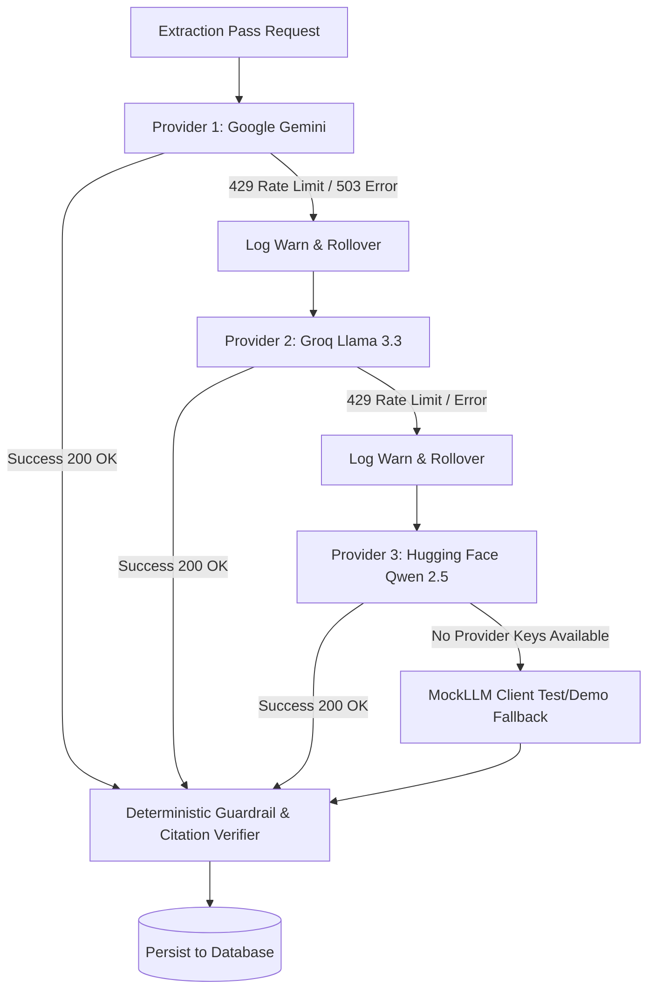

# AGENT_USAGE.md: AI Agent System Architecture & Operational Guide

This document specifies the internal architecture of the AI agents within the **Contract Obligation & Renewal Assistant**, covering prompt versioning, deterministic safety filters, multi-provider rate-limit rollover, verbatim citation verification, and human-in-the-loop review touchpoints.

---

## 1. System Positioning & Core Safety Directives

The AI extraction system operates strictly as an **information-retrieval and structuring engine**. It is explicitly barred from acting as legal counsel, interpreting legal enforceability, or providing advisory opinions.

### System Prompt Directive
Every agent prompt incorporates the following immutable directive:
```text
You are an information extraction assistant. Your job is to extract factual clauses, dates, and obligations from legal contracts.
You MUST NOT provide legal advice, opinion on fairness, legal enforceability, or recommendations to renegotiate.
Extract ONLY what is explicitly stated with exact verbatim source quotes.
```

### Deterministic Post-Filter Guardrail
Even if an underlying model outputs suggestive legal language, the deterministic post-filter (`backend/src/llm/guardrailFilter.ts`) inspects every text field before database persistence. Any phrasing matching banned advisory patterns is automatically scrubbed or flagged:
- `should renegotiate`
- `we advise you to`
- `this clause is unfair`
- `legally invalid / void`
- `seek immediate legal counsel`

---

## 2. Multi-Pass Agent Pipeline & Prompt Versioning

Rather than issuing a monolithic prompt that induces hallucinations or misses fine-print deadlines, the agent pipeline is broken into five targeted, single-responsibility extraction passes:

| Pass | Prompt Module | Extracted Output | Strict Constraints |
| :--- | :--- | :--- | :--- |
| **Pass 1: Parties & Effective Date** | `prompts/parties.v1.ts` | Contracting entities, corporate roles, effective date, governing jurisdiction | Exact entity names, exact section number, verbatim citation quote |
| **Pass 2: Term & Renewal** | `prompts/termAndRenewal.v1.ts` | Initial term, expiration date, renewal type (`auto_renew`, `manual_opt_in`, `none`), advance notice days | Extract notice period in integer days; flag if notice method is specified |
| **Pass 3: Obligations & Milestones** | `prompts/obligations.v1.ts` | Operational obligations, deliverables, payment terms, reporting requirements, recurrence pattern | Must associate each obligation with the responsible party and citation quote |
| **Pass 4: Ambiguities & Conflicts** | `prompts/ambiguities.v1.ts` | Contradictory notice windows, vague standards of performance, policy discrepancies | Compare contract against uploaded policy guidelines; highlight conflicting clauses |
| **Pass 5: Clarification Questions** | `prompts/clarificationQuestions.v1.ts` | Specific multiple-choice questions for human reviewers to resolve ambiguities | Concrete choices (e.g., choice between 30 days vs 60 days); no open-ended legal advice |

All prompts require responses conforming to strict JSON schemas validated via **Zod** (`@contract-assistant/shared`).

---

## 3. Multi-Provider LLM Fallback Chain (Zero Downtime)

To eliminate extraction failures caused by provider rate limits (HTTP 429), token quota exhaustion, or temporary service outages (HTTP 503), the engine implements an automated fallback chain:



### Provider Configuration
Providers are configured in `backend/.env`:
1. `GEMINI_API_KEY` (Gemini 2.5 Flash / 1.5 Pro)
2. `GROQ_API_KEY` (Llama 3.3 70B Versatile)
3. `HUGGINGFACE_API_KEY` (Qwen 2.5 72B Instruct)

If one provider fails with rate-limiting, the pipeline immediately transfers the request to the next healthy provider without dropping the active user request.

---

## 4. Verbatim Citation Verification Mechanism

To combat hallucination and ensure complete operational auditability, every extracted item must include:
1. `sourceSectionId` (the ID of the containing section)
2. `sourceSectionLabel` (e.g. `Section 4.1`)
3. `sourceQuote` (an exact, verbatim excerpt from the section text)

### Deterministic Verification Procedure (`citationVerifier.ts`):
1. **Normalization:** Both the section text and the extracted quote undergo identical normalization:
   - Normalize Unicode whitespace and strip non-printable characters.
   - Collapse consecutive whitespace characters into a single space.
   - Standardize straight and curly quotation marks (`"`, `'`, `“`, `”`).
2. **Sub-string Locating:** The normalized quote is searched inside the normalized section text.
3. **Offset Mapping:** The engine computes the exact character start (`charStart`) and end (`charEnd`) offsets within the section.
4. **Verification Status:**
   - If found: `citationVerified = true`, `confidenceScore = 0.95+`.
   - If not found: `citationVerified = false`, `confidenceScore` is penalized, and the item is visually flagged in the review UI for manual inspection.

---

## 5. Human-in-the-Loop Review Touchpoints

The assistant adheres to a strict principle: **No AI output is considered final until reviewed and approved by a human operator.**

### 1. Split-Screen Review Queue
- The human reviewer inspects candidate items alongside the source document.
- Clicking any citation jumps directly to and highlights the source clause.
- The reviewer can:
  - **Approve**: Confirms the item as accurate.
  - **Reject**: Removes inaccurate or irrelevant extractions.
  - **Edit**: Corrects dates, titles, descriptions, or party assignments.
  - **Date Override**: Sets a custom deadline with a mandatory audit rationale.
  - **Clarification Selection**: Chooses the intended interpretation for ambiguous clauses.

### 2. Bulk Approval Safeguard
- Reviewers cannot bulk-approve items with unverified citations (`citationVerified === false`) or low confidence scores (`confidenceScore < 0.80`).
- These items are withheld from bulk actions, requiring explicit individual human inspection.

### 3. Version Diff & Stale Item Flagging
- When a new version of a contract is uploaded (e.g. v2):
  - Sections are aligned with the previous version.
  - Extracted items are compared against the revised section text using token similarity.
  - If the underlying text changed (similarity < 0.98), the item is flagged as `source_clause_changed`.
  - If the section was removed, it is flagged as `clause_not_found`.
  - The reviewer is required to re-verify or dismiss the affected items before summary compilation.

### 4. Approved-Only Output Boundary
- The **Deadlines Dashboard** and **Reviewed Contract Summary** compile data **strictly** from approved items.
- Unreviewed items are labeled as "Not yet reviewed" with zero operational commitments.
- Rejected items are excluded from exports.
